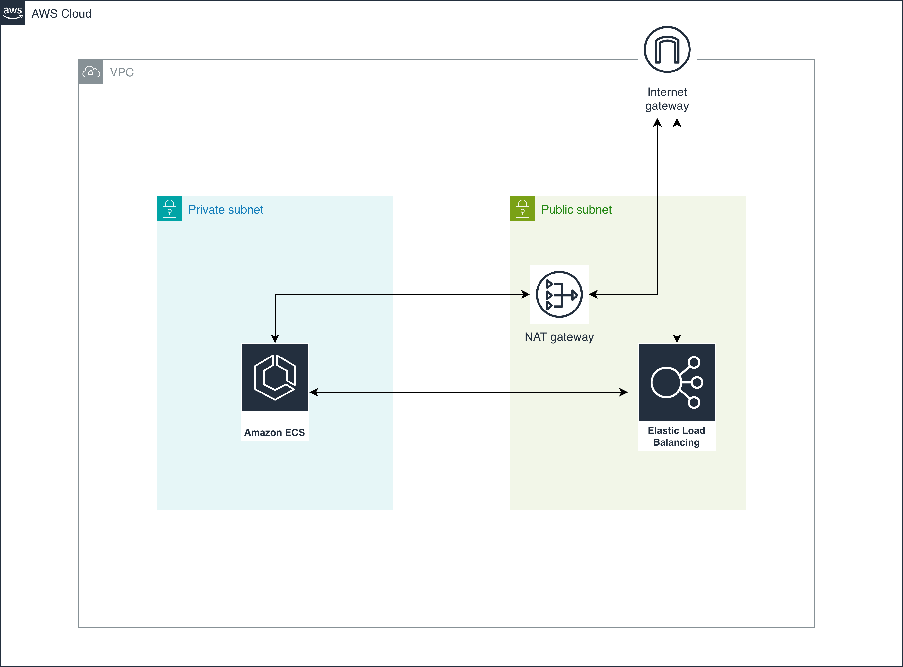

# Particle41 Assessment

This repository contains a Python Flask application deployed on AWS ECS using Terraform.

## Architecture



Architecture of the application includes the following components:

- **Application**: Python Flask app running on port 8080
- **Container**: Docker image pushed to Docker Hub
- **Infrastructure**: AWS ECS Fargate with ALB, VPC, NAT Gateway
- **CI/CD**: GitHub Actions for automated deployment

AWS ECS was choosen to deploy a simple service considering the hosting cost, simplicity and AWS cloud native service.

AWS ECS Fargate spot is used to host the service for further cost saving providing 70% savings.

## Directory Structure

- `application/`: Flask app, Dockerfile, requirements.txt
- `terraform/ecs-terraform-module/`: Terraform configurations
- `.github/workflows/`: GitHub Actions workflow

## Deployment

### Manual Deployment

1. Build and push Docker image:
   ```bash
   cd application
   docker buildx create --use
   docker buildx build --platform linux/amd64,linux/arm64 -t mandargodambe/assessment:latest --push .
   ```

2. Deploy infrastructure:
   ```bash
   cd terraform/ecs-terraform-module
   terraform init
   terraform plan
   terraform apply
   ```

### Automated Deployment

Push to `main` branch to trigger GitHub Actions deployment of infrastructure. Wait for 2 mins to get ECS service up and running after complete deployment

**Required GitHub Secrets:**

Fork the repository > Go to the repo > Setting > Secrets & Variables > Configure AWS account secret key and access key with the key mentioned below:

- `AWS_ACCESS_KEY_ID`
- `AWS_SECRET_ACCESS_KEY`


**Note:** Docker image must be pre-built and pushed to Docker Hub (`mandargodambe/assessment:1.2`).

## Access the Application

After deployment, the ALB DNS name will be output. Access the app at `http://<alb-dns-name>/`.

## 